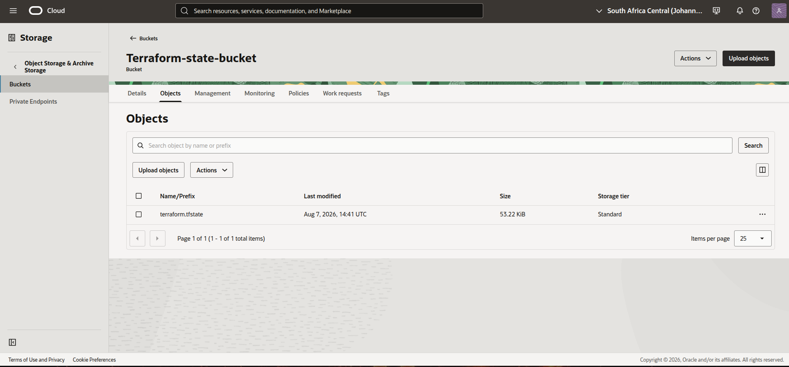
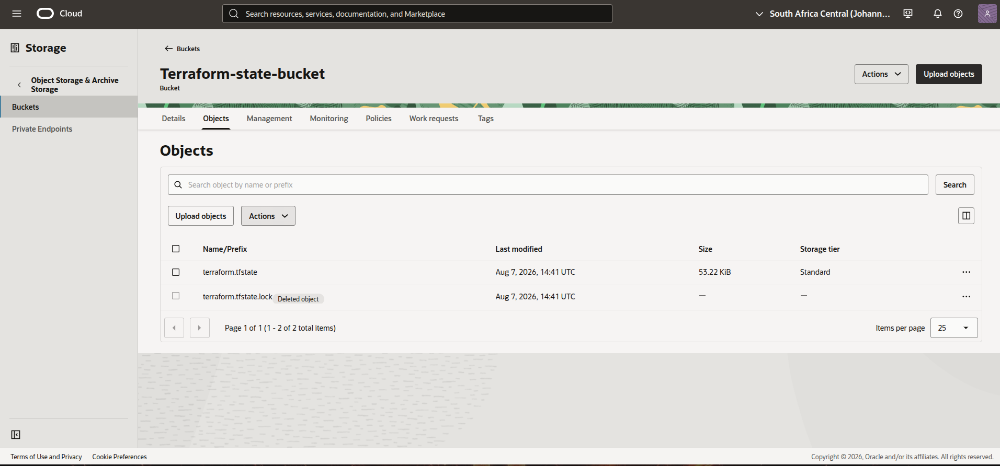
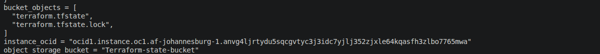

# Notes

## Module configuration
If you need to export values between modules, create an output file for the specific values. Consider the following files: `./terraform/compute.tf`, `./terraform/identity/iam.tf` and `./terraform/identity/outputs.tf`.
  `compute.tf`
  ```hcl
  resource "oci_core_instance" "Test_instance" {
      # line(s) of code
      compartment_id      = module.identity.observability_compartment_id #specified compartment specifically for this project.
      # Line(s) of code
  }
  ```
  `iam.tf`
  ```hcl
  resource "oci_identity_compartment" "observability_compartment" {
    #Required
    compartment_id = var.compartment_id
    description    = "Compartment for isolated observability operations"

    name = "Infra-observe"

  }
  ```
  `outputs.tf`
  ```hcl
  output "observability_compartment_id" {
    description = "OCID of the observability compartment created by the identity module."
    value       = oci_identity_compartment.observability_compartment.id
  }
  ```

The output file declares the OCID for the newly created compartment, whic is to be exported by Terraform module `identity` in the file `./modules.tf`. Running the command `terraform plan` ensures that the value is first exported before any provisioning is made.

**Note:** Always run `terraform init` after module setup to confirm which variables are needed. For custom variables such as `backend_bucket_name`, ensure that they have in the `variables.tf` under the source directory

## Monitoring configuration

*Note:* Metrics for the `cpu_computeagent` namespace cannot be automatically displayed. In this case, the service metrics data source was used for the alarm creation.

## State Management
Having seen articles on state management using AWS' S3 and DynamoDB, I was inspired to do the same with OCI as the cloud platform I'm most proficient in. Luckily, this can be achieved using OCI Object storage.

To set the remote state backend, you first need to plan and apply the configuration. When everything is set, create the remote backend using a new file, `backend.tf` or append this block in `backend-storage.tf`.
  ```hcl
  # Set the backend for remote state management
  terraform {
    backend "oci" {
      bucket    = "<name-of-the-bucket>"
      namespace = "<OCI-OS-namespace>"
    }
  }
  ```
In Terraform, the backend block does not take in variables. Ensure that both of these variables in the block are not committed in code.

### State locking
*A blog post on how to configure state management and lock can be found [here](https://blogs.oracle.com/cloud-infrastructure/terraform-oci-state-locking-backend).*

This is what should be observed once you have successfully set up remote state management.

*Successful remote state configuration*


*Checking terraform locks in bucket (deleted objects)*


*Output from terminal (view narrowed down on bucket objects)*


## Access Management
In the file `./terraform/iam/iam.tf` under the oci_identity_policy block, look at these policies:
  ```hcl
    "Allow group ${oci_identity_group.observability_group.name} to read objects in compartment ${oci_identity_compartment.observability_compartment.name} where target.bucket.name='${var.backend_bucket_name}'"
  ```
These policies ensure that the user account created for this exercise can read objects in the specified bucket for this exercise. The policies declared in the block are based on the assumption that the members of the user group are likely to look into the configuration of this entire setup.

**NB:** *All policies declared are fot learning purposes*